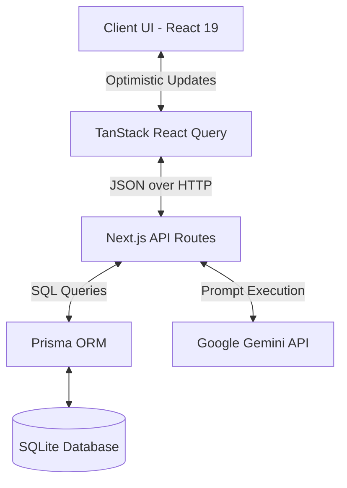

# Solvi - Your Interview Prep Companion

Solvi is a modern, AI-powered spaced repetition tracker designed for mastering data structures and algorithms (specifically the NeetCode 150). It helps software engineers track their progress, intelligently schedule reviews using spaced repetition algorithms, and generate highly personalized, day-by-day study plans using Google's Gemini AI.


## Key Features

### Progress Tracking
* **Interactive Question Sheet**: Track all 150 NeetCode questions with inline optimistic UI status updates (Unsolved, Attempted, Solved).
* **Dashboard Analytics**: Real-time visualization of overall progress, daily solves, and upcoming reviews.

### Spaced Repetition Review System (SRS)
* **Smart Scheduling**: Automatically calculates the next optimal review date based on user confidence scores.
* **Review Queue**: A dedicated daily review dashboard ensuring you never forget previously solved problems.
* **Custom Algorithms**: Implements an interval-based spaced repetition algorithm using custom ease factors.

### AI Study Planning
* **Dynamic Generation**: Generates customized day-by-day study plans tailored to your specific timeline (e.g., 14-day sprint, 60-day relaxed).
* **Gemini Integration**: Powered by Google's Gemini API for intelligent topic distribution.
* **Secure Key Management**: API keys are securely stored in local `sessionStorage` and passed transiently, ensuring they are never persisted on the server.

### Knowledge Vault
* **Interactive Cheatsheet**: A categorized DSA pattern guide featuring syntax-highlighted C++ code snippets, time complexities, and beginner-friendly inline comments.

## Technical Architecture

* **Frontend Stack**: Next.js 16 (App Router), React 19, Tailwind CSS v4, Framer Motion
* **State Management**: TanStack React Query (optimistic updates, caching)
* **Backend Stack**: Next.js Route Handlers (Serverless APIs)
* **Database**: SQLite (local-first development)
* **ORM**: Prisma
* **AI Integration**: `@google/generative-ai`

## Architecture Diagram



## Folder Structure

```text
├── prisma/
│   ├── schema.prisma       # Database schema and models
│   └── dev.db              # Local SQLite database
├── public/                 # Static assets and generated brand images
├── src/
│   ├── app/                # Next.js App Router
│   │   ├── api/            # Serverless API routes (plan, questions, reviews, settings)
│   │   ├── journal/        # DSA Cheatsheet pages
│   │   ├── plan/           # AI Study Plan generator pages
│   │   ├── questions/      # NeetCode 150 tracking table
│   │   ├── reviews/        # Spaced repetition review queue
│   │   └── settings/       # Configuration and danger zone
│   ├── components/         # Reusable UI components (Sidebar, etc.)
│   └── lib/                # Shared utilities and frontend API clients
```

## Database Design

Solvi relies on a relational database managed by Prisma. 

* **User**: Core entity managing identity.
* **Question**: The static list of NeetCode 150 problems.
* **UserQuestionProgress**: Tracks the status (Unsolved, Attempted, Solved) and attempts per question.
* **ReviewSchedule**: Core SRS table. Stores `nextReviewDate`, `interval`, and `easeFactor`.
* **ReviewLog**: Historical record of solve times and confidence scores.
* **StudyPlan**: Stores the JSON output of the Gemini-generated day-by-day roadmap.

## API Documentation

| Method | Route | Purpose | Request Body |
|--------|-------|---------|--------------|
| `GET` | `/api/questions` | Fetch all questions & user progress | - |
| `GET` | `/api/questions/[id]` | Fetch a specific question's details | - |
| `POST` | `/api/questions/[id]/progress` | Update status (Optimistic UI target) | `{ status: string }` |
| `GET` | `/api/reviews` | Fetch questions due for review today | - |
| `GET` | `/api/plan` | Fetch the current user's generated study plan | - |
| `POST` | `/api/plan` | Generate a new AI study plan | `{ apiKey: string, totalDays: number }` |
| `DELETE`| `/api/settings/reset` | Wipe all progress for the current user | - |

## Core Workflows

### Progress Tracking & Optimistic UI Flow
1. User clicks the status dropdown on the Questions table.
2. React Query instantly updates the local cache (Optimistic UI) to reflect the new status.
3. A background `POST` request is fired to `/api/questions/[id]/progress`.
4. The server updates the `UserQuestionProgress` table in SQLite via Prisma.
5. React Query invalidates the cache silently to ensure synchronization.

### AI Study Plan Generation Flow
1. User inputs their Gemini API Key and selects a timeframe (e.g., 30 days).
2. The key is saved strictly to browser `sessionStorage`.
3. The frontend POSTs the requested `totalDays` and the `apiKey` to the server.
4. The API route dynamically constructs a system prompt and calls the Gemini SDK.
5. The resulting JSON plan is stored in the `StudyPlan` table and returned to the client.

## Setup Instructions

### Prerequisites
* Node.js v20+
* npm or pnpm

### Installation
```bash
git clone https://github.com/yourusername/solvi.git
cd solvi
npm install
```

### Environment Variables
Create a `.env` file in the root directory.
| Variable | Description | Default |
|----------|-------------|---------|
| `DATABASE_URL` | Prisma connection string for SQLite | `file:./dev.db` |

*Note: The `GEMINI_API_KEY` is purposefully NOT required in the `.env` file, as it is supplied by the user client-side to prevent server-side secret exposure.*

### Running Locally
```bash
# Push the database schema to SQLite
npx prisma db push

# Start the development server
npm run dev
```

### Production Build
```bash
npm run build
npm start
```

## Engineering Decisions

* **Client-Side AI Key Management**: To make the project easily hostable and open-source friendly, the Gemini API key is supplied by the user and stored in `sessionStorage`. This prevents the maintainer from footing the AI bill and keeps user keys off the server database.
* **TanStack React Query**: Used extensively for data fetching. It enables snappy optimistic UI updates on the Questions table, meaning the UI never blocks while waiting for the database to acknowledge a status change.
* **Tailwind CSS v4**: Utilized the latest Tailwind engine for lightning-fast compilation and modern CSS custom properties (`@theme`).
* **SQLite + Prisma**: Chosen for zero-configuration local development. It allows anyone to clone the repo and get a fully functioning database running instantly without installing Postgres or Docker.

## Security Considerations

* **API Key Handling**: API keys are intentionally kept out of `localStorage` (to prevent persistence across sessions) and are passed dynamically in request bodies rather than stored in the database.
* **Authentication**: Currently operates in a single-tenant/dummy-auth mode. **Future Improvement**: Implement NextAuth.js or Clerk to support multi-tenant user accounts securely.

## Future Improvements

### Planned Features
* LeetCode API integration for automatic progress syncing.
* Advanced charts and heatmaps for GitHub-style contribution tracking.
* Social features (leaderboards, sharing study plans).

### Technical Improvements
* Implement a robust Authentication provider (NextAuth).
* Migrate from SQLite to PostgreSQL (Vercel Postgres/Supabase) for production multi-tenancy.
* Add comprehensive E2E testing using Playwright.

## Tech Stack

| Category | Technology | Purpose |
|----------|------------|---------|
| Framework | Next.js 16 (App Router) | React framework and Serverless API routes |
| Styling | Tailwind CSS v4 | Utility-first styling and design system |
| State | TanStack React Query | Async state management and optimistic UI |
| Database | Prisma ORM & SQLite | Relational data modeling and local persistence |
| AI | Google Generative AI | Dynamic study plan generation |
| Icons | Material Symbols | Standardized iconography |

---
*Designed and built with ❤️ as your ultimate interview prep companion.*
